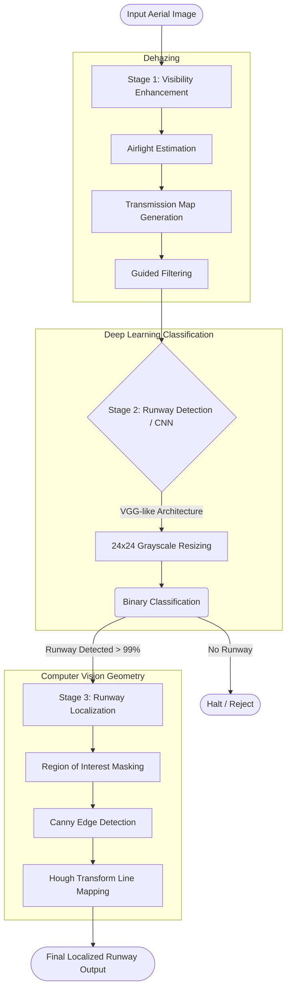

# Runway Detection and Localization in Aerial Images

[](https://www.python.org/)
[](https://tensorflow.org/)
[](https://opencv.org/)

## 📖 Project Overview

Landing accidents are often caused by poor visibility conditions (such as intense fog or haze). This project introduces an innovative method for **runway detection and localization** using a **hybrid learning approach** (combining Digital Image Processing, Deep Learning, and classic Computer Vision) to ensure safe aircraft landings. 

The software cleans the aerial photo, uses an AI model to detect if an airstrip exists, and mathematically maps the boundaries of the concrete directly onto the image so the pilot knows exactly where to align the aircraft.

### 🖼️ The Pipeline (Pictorial Representation)

The core architecture follows a robust three-stage pipeline to guarantee high accuracy even in the worst weather:



#### Detailed Stage Breakdown:
1. **Visibility Enhancement (Dehazing):** Digital image processing removes hazy content. We estimate the optimal airlight and neighborhood transmission distributions, refining them using OpenCV's `guidedFilter` to output a crystal-clear image.
2. **Runway Detection (Deep Learning):** A custom Convolutional Neural Network (CNN) loaded from `runway_weights.hdf5` evaluates the dehazed image to predict whether it contains a runway with high certainty ($\geq 99\%$).
3. **Runway Localization (Machine Learning / CV):** Uses `cv2.Canny` to find structural edges and applies the **Hough Transform Algorithm** (`cv2.HoughLinesP`) to highlight the exact straight paths of the runway on top of the original image, drastically reducing landing accidents (theoretically up to 90%).

---

## 🚀 How to Run the Project

If you'd like to try this out yourself, here are the detailed steps to get the graphical user interface up and running on your local machine.

### Prerequisites
Make sure you have **Python 3.x** installed. The project runs best in a controlled virtual environment. You will need:
- Windows 10 (or compatible Linux/MacOS distribution)
- A minimum of 1GB RAM (Graphics card is optional but helps with CNN inference speed)

### 1. Installation
First, open your terminal, clone the project (or download the ZIP), and install all required framework libraries:
```bash
cd path/to/Runway-Detection

# Install the necessary dependencies
pip install -r requirements.txt
```

### 2. Launching the GUI
To start the software, run the main Graphical User Interface script. It relies on `Tkinter` which is built into standard Python:
```bash
python final_gui.py
```

### 3. Using the Interface
1. **Home Screen**: Click the **Runway Image Detection** button to enter the main processing dashboard.
2. **Upload**: Click **Browse** to select an aerial image. Use the terminal/cmd to observe background pipeline printouts if needed.
3. **Dehaze**: Click the **Dehaze_image** button. The algorithm will run and display the haze-free result.
4. **Localise**: Click the **Localisation** button. The CNN will predict if the image contains a runway. 
   - If it detects a runway, it will map the boundaries and display a popup. 
   - If it doesn't, it will warn you that no runway was found in the cleaned image.

*(Note: There is also a standalone script `final_code.py` if you prefer testing the backend without the UI, and `Road Detection.py` for testing basic Hough transformations on generic roads/video streams.)*

---

## 🤝 How to Contribute

We actively welcome developers, data scientists, and engineers to help us improve the safety and accuracy of this detection system! Whether you're optimizing the dehazing algorithm or expanding the neural network, your contributions are invaluable.

### Contribution Workflow
1. **Fork the Repository**: Create your own copy of the project on GitHub.
2. **Create a Branch**: `git checkout -b feature/AmazingNewFeature`
3. **Make your changes**: Optimize code, add comments, fix UI bugs, or train a new `.hdf5` model!
4. **Commit your changes**: `git commit -m 'Add some AmazingNewFeature'`
5. **Push to the branch**: `git push origin feature/AmazingNewFeature`
6. **Open a Pull Request**: Submit your changes on the main repository for review!

### Areas Needing Help:
- **Model Training**: The current VGG-like miniature model (`train _runway.py`) operates on 24x24 grayscale images. We'd love pull requests testing higher resolution CNNs or ResNet variants.
- **Atmospheric Defaults**: Helping to finetune the arbitrary bounds of `PAR` (Parameters for Transmission estimation) for different dynamic fog density situations.
- **UI Modernization**: Upgrading the Tkinter interface to look more modern (e.g., using PyQt5 or CustomTkinter).

Please make sure all code modifications are clean and document new functions! For major changes, please open an issue first to discuss what you would like to change.

---
*Created to ensure aviation safety and enhance algorithmic accessibility.*
